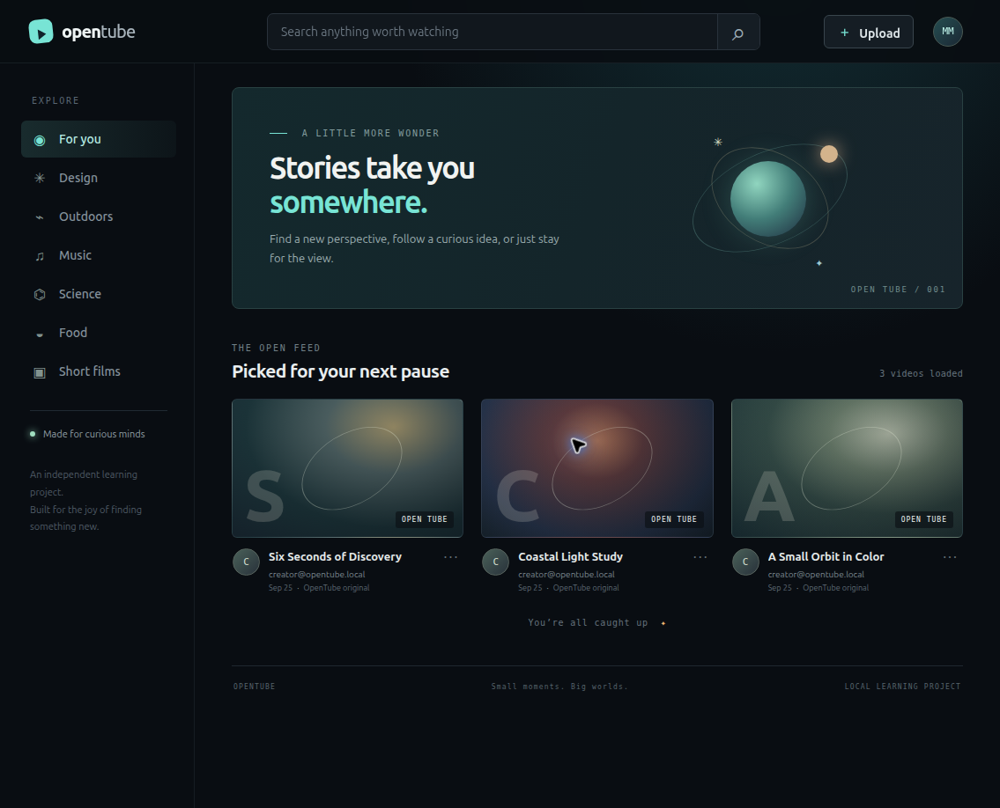
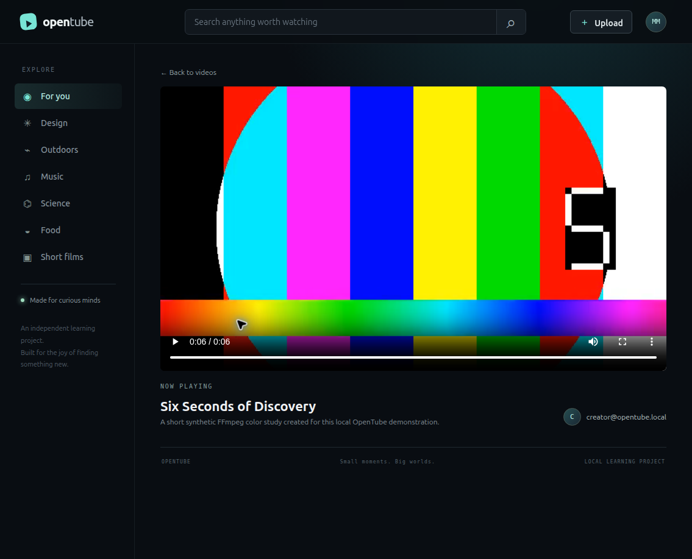
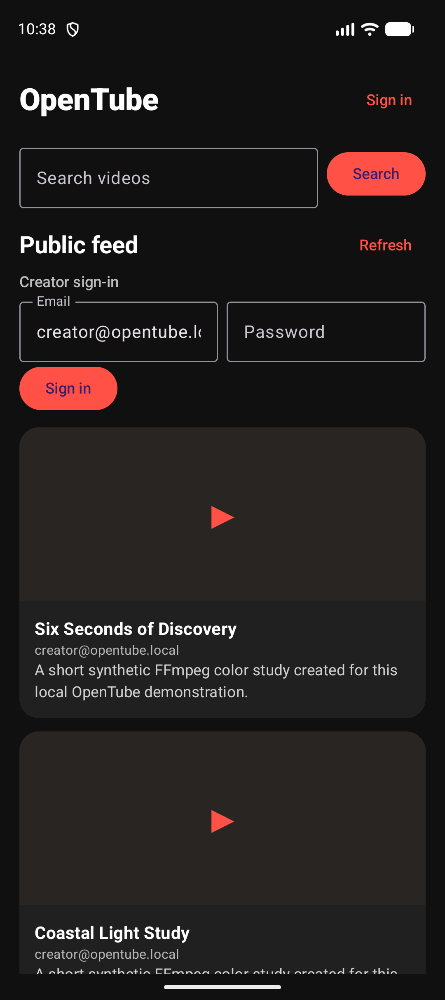
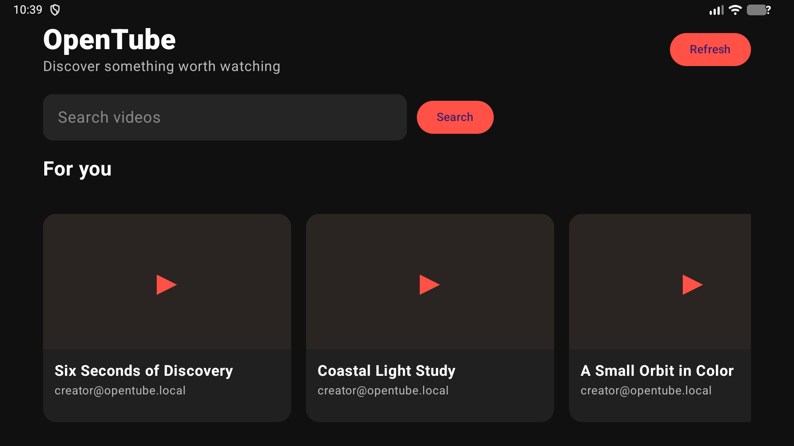

# OpenTube

OpenTube is an independent educational video-sharing MVP for uploading, discovering, and watching videos. It explores the architecture described in ByteByteGo's [Design YouTube](https://bytebytego.com/courses/system-design-interview/design-youtube) chapter; it is not affiliated with YouTube or ByteByteGo and does not include their branding, media, or course figures.

A complete document map is available in the [Documentation index](docs/README.md).

The project focuses on four user flows: sign in with a seeded creator account, upload an MP4, browse/search a public feed with infinite scrolling, and watch processed HLS video. Web and Android phone clients can upload. Android TV is a viewing client controlled by a remote. A video becomes public after successful processing.

## Contents

- [Technology](#technology)
- [Local development](#local-development)
- [Build, deploy, and use prerequisites](#build-deploy-and-use-prerequisites)
- [Build, deploy, use, and undeploy](#build-deploy-use-and-undeploy)
- [Screenshots](#screenshots)
- [AI development disclaimer](#ai-development-disclaimer)

## Technology

- Rust and Axum: `identity-service`, `video-service`, and `transcoding-worker`.
- Vue 3 and TypeScript: `web-frontend`.
- Kotlin and Jetpack Compose: Android phone and Android TV clients.
- PostgreSQL: identity records, video metadata, and transactional outbox; schemas are service-owned.
- RabbitMQ: asynchronous video processing jobs.
- MinIO: local S3-compatible source and HLS object storage.
- Helm and Kind: local Kubernetes deployment with two replicas for stateless application workloads.

Clients use REST/JSON over HTTP. The video service sends processing jobs through RabbitMQ, and the worker reports completion through an internal REST callback; this MVP does not use gRPC.

The ByteByteGo chapter's 5 million daily-active-user and 150 TB/day figures are scenario assumptions only. They are not OpenTube sizing targets or measured results. The local profile uses small synthetic media and does not demonstrate production scale, encryption, or CDN behavior.

## Local development

Prerequisites: Rust stable, Node.js and pnpm, Java 21, Android Studio/SDK, Docker, Kind, kubectl, Helm, PostgreSQL tooling, and FFmpeg. The zsh setup uses `ANDROID_HOME=$HOME/Android/Sdk` and the SDKMAN Kotlin compiler path. `scripts/kind-up.sh` creates an ignored `.env` on first use, recovering credentials from the existing local Kind Secret when available or generating random local values for a new cluster. `.env.example` lists the available settings.

```sh
cargo test --workspace
cd web-frontend && pnpm install && pnpm test
cd ../android-mobile-frontend && ./gradlew testDebugUnitTest createDebugUnitTestCoverageReport
cd ../android-tv-frontend && ./gradlew testDebugUnitTest createDebugUnitTestCoverageReport
```

For the complete local flow, see [docs/system-design.md](docs/system-design.md) and [docs/verification/README.md](docs/verification/README.md). Copy `.env.example` to `.env` and use only local demo values. Never put real credentials in Git.

The local creator email and password are configured by `OPENTUBE_SEED_EMAIL` and `OPENTUBE_SEED_PASSWORD` in the ignored `.env` file. Keep that file private. `scripts/init-local-env.sh` can recover the credentials from the existing Kind Secret or generate random local values for a new cluster.

## Build, deploy, and use prerequisites

- **Build and deploy:** Rust stable, Node.js with pnpm, Java 21, Android Studio/SDK, Docker, the existing Kind cluster, kubectl, Helm, and FFmpeg. See the local environment notes above.
- **Use:** a browser for the web client, or an Android phone/TV emulator or device for the native clients; the local deployment and seeded demo account must be available.

## Build, deploy, use, and undeploy

`./scripts/kind-up.sh` builds and loads the service images, installs the Helm release, and starts local port-forwards. Use the web client at `http://127.0.0.1:8080`; phone and TV clients can use the configured local API endpoints through the script's ADB reverse setup. The [Helm resource budget record](docs/kubernetes-resources.md) lists CPU and memory requests and limits for every pod container.

Stop the script-managed port-forwards with `./scripts/kind-port-forward-stop.sh`, then remove the release while preserving PostgreSQL, RabbitMQ, and MinIO claims:

```sh
helm --kube-context kind-kind uninstall opentube --namespace opentube
```

Do not delete the namespace or PVCs when retaining application data. Removing the release does not delete persistent data.

## Screenshots










## AI development disclaimer

> **AI development disclaimer:** This project was built entirely with GPT-6 Luna at Max effort as a proof of concept exploring how low-cost AI plans can be useful when paired with disciplined harness and loop engineering. This is project-owner attribution; repository contents do not independently verify runtime model metadata. Review AI-generated design and code before relying on them.
