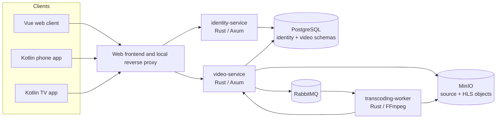

# OpenTube System Design

**Status:** Proposed local MVP
**Owner:** OpenTube maintainers
**Last updated:** 2026-09-24
**Scope:** Local educational video upload, discovery, search, and playback across web, Android phone, and Android TV.

> Project documentation index: [Documentation index](README.md)

> Project decision records: [ADR index](adr/README.md).

> Database tables, columns, and ownership: [Database model](database-model.md).

## Contents

- [1. Abstract](#1-abstract)
- [2. Goals and non-goals](#2-goals-and-non-goals)
- [3. Background and problem statement](#3-background-and-problem-statement)
- [4. Proposed architecture](#4-proposed-architecture)
- [5. Request lifecycle](#5-request-lifecycle)
- [6. API and data contracts](#6-api-and-data-contracts)
- [7. Consistency, idempotency, and replay](#7-consistency-idempotency-and-replay)
- [8. Security and privacy considerations](#8-security-and-privacy-considerations)
- [9. Operational readiness](#9-operational-readiness)
- [10. Alternatives considered](#10-alternatives-considered)
- [11. Open questions](#11-open-questions)
- [12. Decision and next steps](#12-decision-and-next-steps)
- [Requirements traceability](#requirements-traceability)
- [References](#references)

## 1. Abstract

OpenTube demonstrates the core lifecycle of a video-sharing service: an authenticated creator uploads an MP4 directly to object storage, a worker converts it to HLS, and the video becomes visible in a cursor-paginated public catalog only after conversion succeeds. A web client and native Android clients browse, search, and play the resulting media. The Android phone and web client also support upload; Android TV is a remote-controlled viewing client.

This is a local learning system deployed to Kind. It does not implement a production CDN, multi-region storage, production TLS or encryption, commercial content rights, monetization, or the scale described in the source interview. ByteByteGo's 5 million DAU and 150 TB/day figures are scenario assumptions from its chapter, not OpenTube measurements.

## 2. Goals and non-goals

| Goals | Non-goals |
| --- | --- |
| **G1** Upload valid MP4 videos up to 1 GB and publish only after processing. | **N1** Public internet hosting or production security certification. |
| **G2** Browse/search public videos with stable, duplicate-free infinite scrolling. | **N2** Comments, likes, subscriptions, playlists, live streams, or recommendations. |
| **G3** Play adaptive HLS on web, Android phone, and Android TV. | **N3** Production-scale CDN, multi-region replication, or benchmark guarantees. |
| **G4** Run all server workloads with two replicas in local Kind. | **N4** Self-service registration or multiple account roles. |

## 3. Background and problem statement

The referenced system-design exercise centers on upload and playback across browser, mobile, and smart TV clients. It recommends object storage for media, asynchronous transcoding, metadata APIs, and adaptive HTTP streaming. OpenTube uses those patterns at local learning scale and implements only the user's selected MVP scope.

The implementation keeps the video aggregate and its public catalog in one video bounded context. That avoids cross-service catalog projections for the MVP. Identity remains a separate bounded context. Processing crosses an asynchronous boundary because video encoding is CPU-intensive and can take longer than an API request. The primary invariant is: **a video is not discoverable or playable until its HLS master playlist and renditions exist and the video state is committed as ready.**

## 4. Proposed architecture



| Component | Responsibility | Primary storage | Failure behavior |
| --- | --- | --- | --- |
| `identity-service` | Verify the seeded creator account and issue signed JWTs. | PostgreSQL `identity` schema. | Fail closed if credentials or database are unavailable. |
| `video-service` | Own video metadata, upload lifecycle, public feed/search, playback metadata, and outbox relay. | PostgreSQL `video` schema and MinIO. | Do not report an upload as accepted until its durable state exists. Keep non-ready videos out of public queries. |
| `transcoding-worker` | Consume upload jobs, validate inputs, create HLS output, and report terminal state. | RabbitMQ and MinIO; job identity comes from the message. | Retry transient errors with bounded attempts; dead-letter terminal failures; make repeated jobs idempotent. |
| Web frontend / reverse proxy | Serve the Vue UI and route same-origin `/api` requests. | Static build only. | API requests fail visibly and can be retried; frontend remains stateless. |
| Android clients | Phone upload/viewing; TV browse/search/feed/playback with D-pad focus. | Device-local auth token only. | Preserve feed position and show recoverable network/player errors. |
| PostgreSQL, RabbitMQ, MinIO | Local durable metadata, work queue, and object storage. | Single-replica Kind dependencies. | Local learning profile only; backup and HA are outside scope. |

All API, worker, and web Deployments use two replicas. The Android apps are built and tested as clients rather than Kubernetes Deployments. Kind dependency Deployments use one replica to keep the local cluster small. No public Ingress is created. Host access uses loopback-bound port-forwards, and Android emulator requests use `adb reverse`.

Production architecture would place object storage behind a CDN and require TLS and provider-managed encryption. Those are requirements to revisit before any public deployment; the local profile is not evidence of them.

The local chart pins `ghcr.io/coollabsio/minio:RELEASE.2025-10-15T17-29-55Z`, a public build from the upstream MinIO source. The prior Docker Hub image reference could not be pulled in this environment. This image choice only supports this local learning profile; review current maintenance and security before any shared or production deployment.

## 5. Request lifecycle

### Upload and processing

1. The creator signs in through `identity-service`; the local seed account is provisioned from development-only configuration.
2. The client requests a video record with title, description, MP4 content type, and file size. `video-service` checks the JWT, 1 GB cap, and request fields, then creates a `pending_upload` record and returns a short-lived presigned MinIO PUT URL.
3. The client uploads the bytes directly to MinIO. It then calls the completion endpoint. The service checks that the expected object exists and its size matches the declared size.
4. A database transaction changes the video to `uploaded` and inserts an outbox row. The outbox relay publishes the versioned `video.uploaded.v1` message to RabbitMQ; it marks the row delivered only after broker confirmation.
5. The worker downloads the object, uses `ffprobe` to inspect it, and uses FFmpeg to produce H.264/AAC HLS renditions at 360p, 720p, and 1080p where the source resolution permits. It writes outputs to a deterministic per-video prefix.
6. After the master playlist and all required renditions are stored, the worker calls the internal completion endpoint. `video-service` atomically marks the record `ready` and sets `published_at`; repeated callbacks for a ready video return the same result.
7. Malformed files and exhausted retries mark the record `failed` with a safe error code. Failure details do not include secrets or raw file contents.

```mermaid
sequenceDiagram
  actor Creator
  participant Client
  participant Video as video-service
  participant Store as MinIO
  participant DB as PostgreSQL + outbox
  participant Queue as RabbitMQ
  participant Worker as transcoding-worker
  Creator->>Client: Sign in and select MP4
  Client->>Video: Create video (JWT, metadata)
  Video->>DB: Insert pending_upload
  Video-->>Client: video_id + presigned PUT URL
  Client->>Store: Upload MP4 bytes
  Client->>Video: Complete upload
  Video->>Store: HEAD source object
  Video->>DB: uploaded state + outbox row
  DB-->>Video: commit
  Video->>Queue: Publish video.uploaded.v1
  Queue-->>Worker: Delivery
  Worker->>Store: Read source; write HLS outputs
  Worker->>Video: Internal processing result (idempotency key)
  Video->>DB: ready + published_at
  Video-->>Worker: Acknowledge result
  Worker-->>Queue: Ack job
  Client->>Video: Browse/search/feed
  Video-->>Client: ready videos + next_cursor
  Client->>Store: Read HLS playlist and segments
```

### Browse and infinite scrolling

`GET /v1/videos?query=&cursor=&limit=24` returns only ready videos. It orders by `published_at DESC, id DESC`, uses that tuple as the opaque keyset cursor, and caps `limit` at 50. Search uses PostgreSQL full-text search over title and description. Each response has `items` and nullable `next_cursor`. A request without a cursor starts a new result set. Clients append a page only if its IDs are not already present; changing the query resets the cursor and list. Web uses an intersection sentinel plus an accessible load-more button; phone uses a lazy list; TV uses focus-aware lazy rows and loads another page near the end.

## 6. API and data contracts

### HTTP contracts

The clients call the identity and video APIs using REST/JSON over HTTP. For service-to-service work, video-service publishes processing jobs through RabbitMQ, and the worker reports completion to video-service through the internal REST callback. This MVP does not use gRPC.

| Endpoint | Access | Contract |
| --- | --- | --- |
| `POST /v1/login` | Public, local account only | Request `{email,password}`; response `{access_token,token_type,expires_in}`. |
| `POST /v1/videos` | Creator JWT | Request `{title,description,content_type,size_bytes}`; response `{id,status,upload_url,upload_expires_at}`. Only `video/mp4`, non-empty metadata, and size `1..=1_073_741_824` are accepted. |
| `POST /v1/videos/{id}/complete` | Owner JWT | Verifies object existence/size and returns `{id,status}`. Duplicate completion is safe. |
| `GET /v1/videos?query=&cursor=&limit=24` | Public | Response `{items:[VideoSummary],next_cursor}`; ready-only keyset pagination. |
| `GET /v1/videos/{id}` | Public | Ready video metadata, creator display name, duration, and master-playlist URL. Non-ready videos return not found. |
| `POST /internal/videos/{id}/processing-result` | Worker token | Versioned success/failure callback with deterministic output prefix and idempotency key. Not exposed externally. |
| `GET /health/live`, `/health/ready`, `/metrics` | Internal/local | Liveness, dependency readiness, and Prometheus-format metrics. |

### Data ownership

- `identity.users`: user ID, normalized email, password hash, display name, and created timestamp. Only the identity service reads or writes this schema.
- `video.videos`: ID, owner ID, title, description, declared byte size, MIME type, source object key, HLS prefix, status, safe failure code, created timestamp, and optional published timestamp. Only the video service owns this schema.
- `video.outbox`: event ID, aggregate ID, event type/version, JSON payload, creation/delivery timestamps, and attempt count. It is written in the same transaction as video state.

### Event contract

`video.uploaded.v1` carries `event_id`, `video_id`, `source_object_key`, `content_type`, `size_bytes`, `schema_version`, and `occurred_at`. It contains no password, JWT, or media bytes. Consumers must treat delivery as at least once. Output keys are deterministic from `video_id`; processing result callbacks are idempotent. A repeated event may redo work but cannot create a second public video.


### Contract ownership and consumers

| Interface | Owner | Producer | Known consumers by repository/component | Authority |
| --- | --- | --- | --- | --- |
| Identity REST/JWT API | `opentube` / `identity-service` | `identity-service` | Same repository: `web-frontend`, `android-mobile-frontend` when authentication is required; other-repository consumers: unknown | [OpenAPI](../contracts/openapi.yaml) and identity service |
| Video, upload, catalog, and playback REST API | `opentube` / `video-service` | `video-service` | Same repository: `web-frontend`, `android-mobile-frontend`, `android-tv-frontend`; other-repository consumers: unknown | [OpenAPI](../contracts/openapi.yaml) and video service |
| `video.uploaded.v1` event | `opentube` / `video-service` owns event; `transcoding-worker` owns handling | `video-service` | Same repository: `transcoding-worker`; other-repository consumers: unknown | [Contract catalog](contracts/README.md), outbox, and worker source |
| Processing result callback | `opentube` / `video-service` owns state transition | `transcoding-worker` | Same repository: `video-service`; other-repository consumers: unknown | [OpenAPI](../contracts/openapi.yaml) and service source |

See the [contract catalog](contracts/README.md) for schema ownership and compatibility.

## 7. Consistency, idempotency, and replay

The upload-complete database transaction is the point where processing becomes eligible. The outbox closes the database/broker dual-write gap. The worker acknowledges only after durable output storage and a successful idempotent callback. A retry checks the output prefix and safely replaces generated outputs. An invalid MP4 becomes a terminal `failed` state; transient MinIO, RabbitMQ, or video-service errors retry with bounded exponential backoff. After five deliveries, the message is dead-lettered and surfaced for local operator review. The feed is read-your-write only after processing commits `ready`; processing itself is asynchronous.

| Scenario | Expected behavior | Reason |
| --- | --- | --- |
| Duplicate completion or message | Keep one video lifecycle; safely repeat the processing result. | Unique IDs, deterministic objects, idempotent state transition. |
| Database commit fails | Do not publish or claim completion. | Outbox row and state share one transaction. |
| Broker or MinIO is temporarily unavailable | Retry within the configured budget; keep video non-public. | Processing is asynchronous and `ready` is gated. |
| Malformed or unsupported media | Mark failed with safe reason; do not expose the source. | Invalid content must not enter the public feed. |

## 8. Security and privacy considerations

- The local creator account uses Argon2id password hashing. JWTs are short-lived and signed using a local-only key supplied through an untracked environment file or generated Kubernetes Secret.
- The video service checks ownership for upload operations. Public read endpoints return only ready videos. Worker callbacks use a separate local service token.
- CORS is limited to local web origins. Presigned URLs are short-lived and scoped to one object key and PUT method. No object-store credentials are sent to clients.
- Logs contain request IDs and safe error codes, not passwords, tokens, signed URLs, or uploaded media content. The demo uses synthetic personal data and synthetic media only.
- All local services are reachable through loopback port-forwards; there is no public Ingress. The local profile uses development credentials and does not satisfy production TLS, encryption-at-rest, abuse prevention, or content moderation requirements.
- Retention and deletion policy are not implemented in this local MVP. A public deployment requires product and legal review before real content is accepted.

## 9. Operational readiness

| Signal | Local check | Owner | Gate |
| --- | --- | --- | --- |
| API readiness | `/health/ready` checks its database and required queue/object-store configuration. | Service maintainers | Required for Kind E2E. |
| Upload/process success | `video_upload_total`, `transcode_success_total`, `transcode_failure_total`. | Video/worker maintainers | Metrics scrape and success/failure test. |
| Request/worker latency | `http_request_duration_seconds`, `transcode_duration_seconds`. | Service maintainers | Emit histogram; establish production threshold only with workload data. |
| Queue backlog/retries | RabbitMQ ready/unacked count and worker retry/DLQ counters. | Worker maintainers | Exercise retry and terminal-failure paths. |
| Data recovery | PostgreSQL PVC and MinIO PVC survive pod restart. | Local operator | Restart test in Kind. |

Rollout is a local Helm install in namespace `opentube`. Use loopback-bound port-forwards, verify health, run the Kind end-to-end flow, and uninstall only the OpenTube release when finished. The `notification-system` namespace is out of scope. Dependencies run one replica; application Deployments run two replicas. Rollback uses the preceding Helm revision. Do not expose the local demo to a public network.


### Resource budgets and Kubernetes practice

Every pod template has CPU and memory requests and limits for each regular and init container. The concrete local values are maintained in [Kubernetes resource budgets](kubernetes-resources.md); they are local defaults, not measured consumption or production sizing. Measure representative workloads in the target environment, set requests for observed baseline needs and limits for acceptable bursts, then monitor CPU throttling, memory pressure, and OOM events and adjust deliberately.

## 10. Alternatives considered

| Alternative | Why considered | Decision |
| --- | --- | --- |
| Upload bytes through the API | Simpler client network setup. | Presigned MinIO upload keeps large bytes off Rust API pods. |
| Store video bytes in PostgreSQL | One database dependency. | Object storage handles binary media; PostgreSQL stores metadata only. |
| Synchronous transcoding in API request | Fewer components. | RabbitMQ worker isolates CPU-heavy and long-running work. |
| Redis/Elasticsearch/recommendation service | Common at production scale. | PostgreSQL full-text and keyset pagination meet the local MVP needs. |
| CQRS/event sourcing | Strong audit/replay options. | One video aggregate plus transactional outbox is sufficient; event sourcing is out of scope. |

### Architecture practice fit

DDD is useful for the Identity and Video Catalog ownership boundaries and for the video readiness invariant; transcoding remains a separate execution role because it has a CPU-heavy, asynchronous lifecycle. Apply Clean Architecture selectively inside those services so lifecycle rules can be tested without MinIO, RabbitMQ, or HTTP, while keeping adapters and deployment count small. Full CQRS is not justified: feed and status reads use the same video lifecycle and the transactional outbox already isolates processing. Add a read projection only if measured catalog queries outgrow PostgreSQL indexes and the acceptable staleness is explicit. Keep YAGNI, KISS, and DRY as constraints against adding recommendation, event-sourcing, or generic abstraction layers before product requirements call for them.

## 11. Open questions

No local MVP product choices remain open. Production deployment would require new decisions for SLOs, regional availability, real-account onboarding, content moderation, retention/deletion, encryption, and CDN/provider selection. Those decisions are intentionally outside this local implementation.

## 12. Decision and next steps

The scoped local MVP is implemented in this repository. Verification commands, observed results, measured Sonar coverage, and local-only limitations are recorded in `docs/verification/`. The latest scan reports at least 80% overall coverage and passing quality gates for all seven OpenTube projects; exact measures and evidence are in [`verification/sonarqube.md`](verification/sonarqube.md). New-code attribution may be incomplete for the uncommitted working tree. Production security and capacity remain out of scope until new requirements and evidence are available.

## Requirements traceability

| ID | Requirement | Evidence |
| --- | --- | --- |
| R1 | Seeded creator login | Identity service tests and client login E2E. |
| R2 | MP4 upload up to 1 GB | API boundary tests, MinIO integration, upload E2E. |
| R3 | Public only after successful processing | Lifecycle unit/integration tests and Kind flow. |
| R4 | HLS adaptive playback on web/phone/TV | Kind verifies generated HLS playlists and segments; browser E2E requests playback; phone and TV emulator checks open the playback view with a synthetic fixture. Emulator checks do not assert rendered frames or playback quality. |
| R5 | Search and infinite scrolling | Cursor/query tests and cross-page E2E with no duplicates. |
| R6 | DDD Rust backends and asynchronous processing | Context/API contracts, Rust tests, and idempotent processing-result handling. |
| R7 | Two replicas for application workloads in Kind | Helm values and `kubectl get deployments` evidence. |
| R8 | Local learning-only security and scale claims | README, Helm setup, and verification limitations. |
| R9 | SonarQube projects and quality gates | Seven project analyses, all at least 80% overall coverage with passing server gates; see [SonarQube verification](verification/sonarqube.md). |
| R10 | JEV readiness score | `docs/verification/jev-readiness.md` with returned score evidence. |
| R11 | Unit, integration, web/Android E2E | Test reports and exact commands in the verification record; Android emulator tests cover browse, sign-in, upload validation/client storage responses, and the playback view. |
| R12 | Conventional Commits 1.0.0 | Commit history, if commits are created. |

## References

- ByteByteGo, [Design YouTube](https://bytebytego.com/courses/system-design-interview/design-youtube). Its scale figures are interview-scenario inputs, not observed OpenTube data.
- [OpenDesign](https://github.com/nexu-io/open-design) is the requested design reference; the local UI was unavailable during this run, so no OpenDesign-generated prototypes are included. No logos or third-party video assets are reused.
- Local MinIO image package: [Coollabs MinIO container](https://github.com/coollabsio/minio/pkgs/container/minio), built from the archived upstream community source.
- Android Developers, [Compose for TV](https://developer.android.com/training/tv/playback/compose) and [Media3 HLS](https://developer.android.com/media/media3/exoplayer/hls).
- [Conventional Commits 1.0.0](https://www.conventionalcommits.org/en/v1.0.0/).
